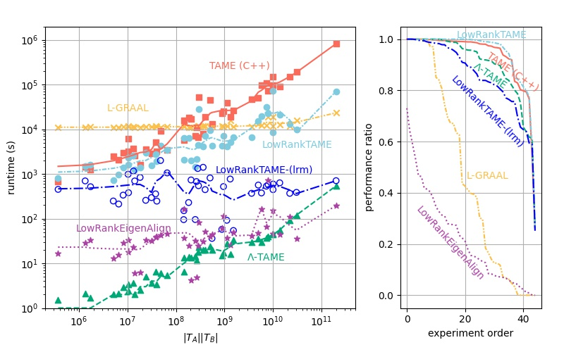

LambdaTAME
==========

A julia (v1.5) implementation of the LambdaTAME, LowRankTAME, and TAME heurestics for pairwise graph alignments.

Contents
=======
* LambdaTAME.jl:
   Top file
* Experiments.jl:
    Routines for running synthetic experiments or local tensor files 
* Matchings.jl:
    Routines for finding low rank matches. 
* TAME_Implementations.jl:
    Implementations of the TAME, \Lambda-TAME, and low rank TAME routines.
* Contractions.jl:
    Routines for computing the tensor contraction operations
* PostProcessing.jl:
  Routines for the post-processing portion of the TAME algorithm. **in developement**
  
Dependencies
===========
[LinearAlgebra](https://docs.julialang.org/en/v1/stdlib/LinearAlgebra/) and  [SparseArrays](https://docs.julialang.org/en/v1/stdlib/SparseArrays/index.html) for sparse numerical linear algebra routines.  [MatrixNetworks](https://github.com/nassarhuda/MatrixNetworks.jl) for finding triangle motifs in arbitrary graphs and random graph generation ([TGPA](https://github.com/eikmeier/TGPA) source code also used for generating the HyperKron models). 

[NPZ](https://github.com/fhs/NPZ.jl), [Random](https://docs.julialang.org/en/v1/stdlib/Random/), and 
[Distributed](https://docs.julialang.org/en/v1/stdlib/Distributed/) for saving, generating, and running experiments (in parallel) respectively. 

[DataStructures](https://github.com/JuliaCollections/DataStructures.jl) used in postprocessing algorithm for finding swap candidates efficiently. 

[Tests](https://docs.julialang.org/en/v1/stdlib/Test/) and [Suppressor](https://github.com/JuliaIO/Suppressor.jl) for testing. 

Data
====
included files are sparse matrix and sparse tensor (.smat and .ssten files respectively) representations of the subset of PPI networks from the [LVGNA](https://www3.nd.edu/~cone/LNA_GNA/) project which we use (original .gw files can be directly downloaded [here](https://www3.nd.edu/~cone/LNA_GNA/networks.zip)). Data is included for convenience of recreating our experiments. If utilizing these files, please add appropriate citations to their original project source. 

Exported Functions
==================

### Experiment Drivers
* distributed_pairwise_alignment
* distributed_random_trials
* align_tensors
* align_tensors_profiled
* align_matrices
* random_graph_exp

### ThirdOrderSymTensor Helpers
* load_ThirdOrderSymTensor
* graph_to_ThirdOrderTensor

### Matching Routines
 * bipartite_matching_primal_dual

### Spectral Relaxation Routines
* ΛTAME
* LowRankTAME
* LowRankTAME_profiled
* TAME
* TAME_profiled

